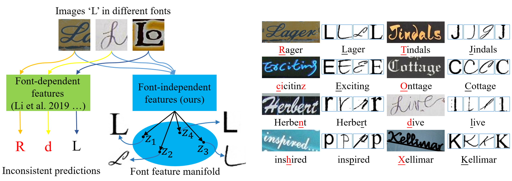
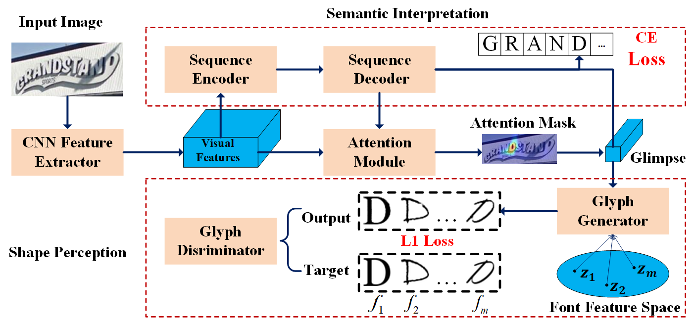

## Exploring Font-independent Features for Scene Text Recognition

This is the official Tensorflow implementation of the Exploring Font-independent Features for Scene Text Recognition.

The preprint and the [code](https://github.com/Actasidiot/EFIFSTR) will be released soon.

### Abstract

Scene text recognition (STR) has been extensively studied in last few years. Many recently-proposed methods are specially designed to accommodate the arbitrary shape, layout and orientation of scene texts, but ignoring that various font (or writing) styles also pose severe challenges to STR. These methods, where font features and content features of characters are tangled, perform poorly in text recognition on scene images with texts in novel font styles. To address this problem, we explore font-independent features of scene texts via attentional generation of glyphs in a large number of font styles. Specifically, we introduce trainable font embeddings to shape the font styles of generated glyphs, with the image feature of scene text only representing its essential patterns. The generation process is directed by the spatial attention mechanism, which effectively copes with irregular texts and generates higher-quality glyphs than existing image-to-image translation methods. Experiments conducted on several STR benchmarks demonstrate the superiority of our method compared to the state of the art.

## Model Architecture

