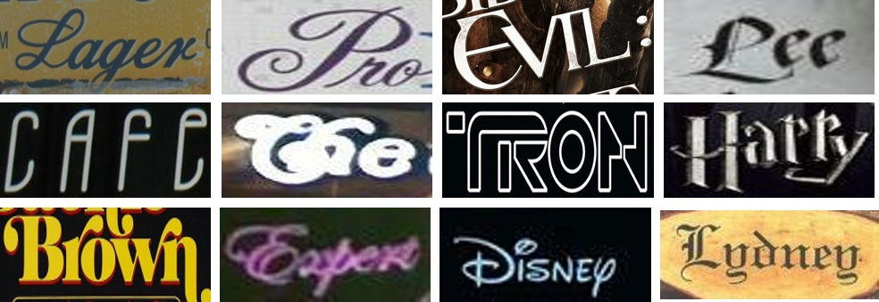

## Exploring Font-independent Features for Scene Text Recognition

This is the official Tensorflow implementation of the paper:

**Yizhi Wang and Zhouhui Lian. Exploring Font-independent Features for Scene Text Recognition. ACM Multimedia. 2020.**


## Novel Font Scene Text (NFST) Dataset

As scene texts in novel font styles only make up a small proportion in existing benchmarks, we collect 100 text images with novel or unusual font styles to form a new dataset named as the Novel Font Scene Text (NFST) dataset ([download link](https://raw.githubusercontent.com/Actasidiot/EFIFSTR/master/NFST.zip)).
<div align=center>
	 
</div>

We compare our method with other two state-of-the-art methods ([ASTER](https://github.com/bgshih/aster) and [SAR](https://github.com/wangpengnorman/SAR-Strong-Baseline-for-Text-Recognition)) whose codes are publicly available. Our method significantly outperforms others on this dataset (see the following table), whose robustness to font style variance is proved.

<div align=center>
<table>
    <thead>
        <tr>
            <th>Training data</th>
            <th>Ours</th>
            <th>SAR</th>
	    <th>ASETR</th>
        </tr>
    </thead>
    <tbody>
        <tr>
            <th>90K+ST</th>
            <th>55</th>
            <th>45</th>
	    <th>44</th>
        </tr>
        <tr>
            <th>90K+ST+SA+R</th>
            <th>71</th>
            <th>63</th>
	    <th>58</th>
        </tr>
    </tbody>
</table>
</div>

## Installation

### Requirement

- **python 3.6**
- **TensorFlow 1.15**

We highly recommend using Anaconda to build the environment:

```shell
conda create -n efifstr python=3.6
source activate efifstr
pip install editdistance edit_distance
conda install tensorflow-gpu=1.15
```
We reuse some code from [ASTER](https://github.com/bgshih/aster), which is derived from Tensorflow Object Detection API.

### Build the custom operators and protobuf files
  1. Go to `c_ops/` and run `build.sh` to build the custom operators
  2. Execute `protoc protos/*.proto --python_out=.` to build the protobuf files

## Pretrained-model

The pretrained model files are available on this [link](https://drive.google.com/file/d/1zRKcbZ-2EQ5w3igTQWusKNrbHhi11Tj4/view?usp=sharing). Download `model-demo.zip` and extract it under `experiments/demo/log/`.

To test the preformance of the pretrained-model, simply execute:

```
python eval.py
```

This will output the recognition result of NFSF dataset.

## Training and on-the-fly evaluation

Data preparation scripts for several popular scene text datasets are located under `tools`. See their source code for usage.

The multi-font glyph images are available on this [link](https://drive.google.com/file/d/1datPscKB3VvmcwVanHXFM4IqlCrmp64r/view?usp=sharing). Download `glyphs-325-fonts.npy` and put it under `data/`.

To run the example training, run

```
python train.py
```

Change the configuration in `experiments/demo/trainval.prototxt` to configure your own training process.

During the training, you can run a separate program to repeatedly evaluates the produced checkpoints.

```
python eval.py
```

Evaluation configuration is also in `trainval.prototxt`.


